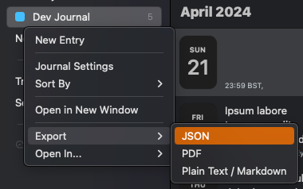
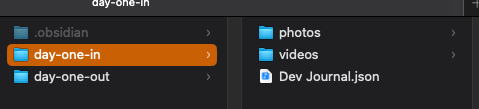
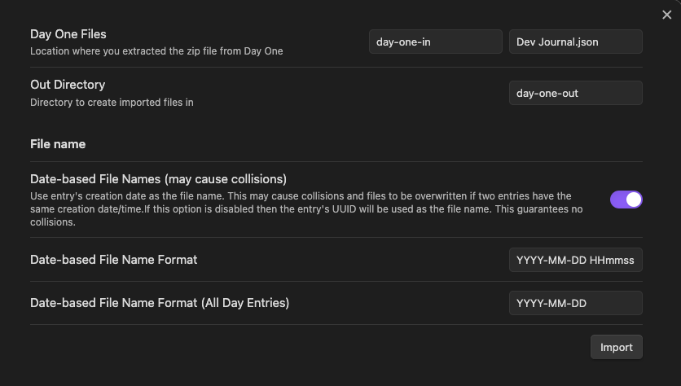
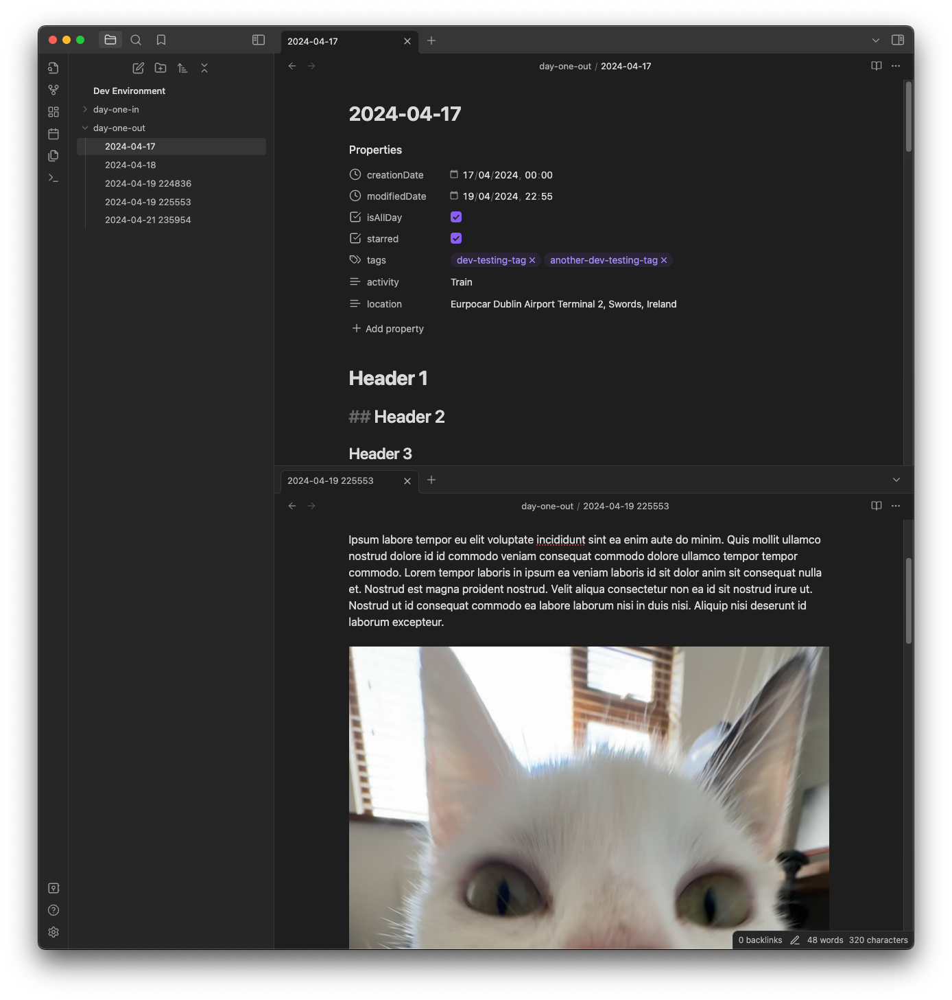

# Obsidian Day One Importer

Easily convert your Day One journals into Obsidian markdown.

## How to import

1. Export your Day One journal as JSON

   

2. Extract the `.zip` file you are given into a folder in your Obsidian vault. The default folder is a top level
   folder called `day-one-in`, but this is customizable in the settings

   

   > [!NOTE]
   > You may not see the `.json` file in Obsidian, this is fine as long as it is there in your system file explorer

3. Adjust the settings to match what your setup

   

4. Click import and verify all your entries have been created in the folder you designated

   

5. If there were any errors when importing, a file called `Failed Imports.md` will be created in that directory with the
   reason that the import failed. This may be caused by a conflicting file name (e.g. if you used date-based file
   names with the format YYYY-MM-DD and had two files on the same date).

6. Once you are happy with your import, you can delete the journal JSON file and move the photos/videos to wherever
   you prefer

**If something doesn't seem right please file an issue on this repository.**

## Features

### Supported

- Text entries
- Rich text
- Date-based file names or UUID file names
- Attachments: photos, videos, PDFs, audios
- Day One internal links can be converted to Obsidian links

#### Added to frontmatter

- Tags (with configurable tag styles, e.g. `camelCase`, `snake_case`)
- If entry is starred
- If entry is pinned
- If entry is "all day"
- Location (name & coordinates)
- Activity (e.g. walking, cycling, train, flying, etc)

### Not Currently Planned

- Customizable metadata formats (i.e not in frontmatter)
- Weather

## OSS

- [Zod](https://zod.dev/): MIT License
